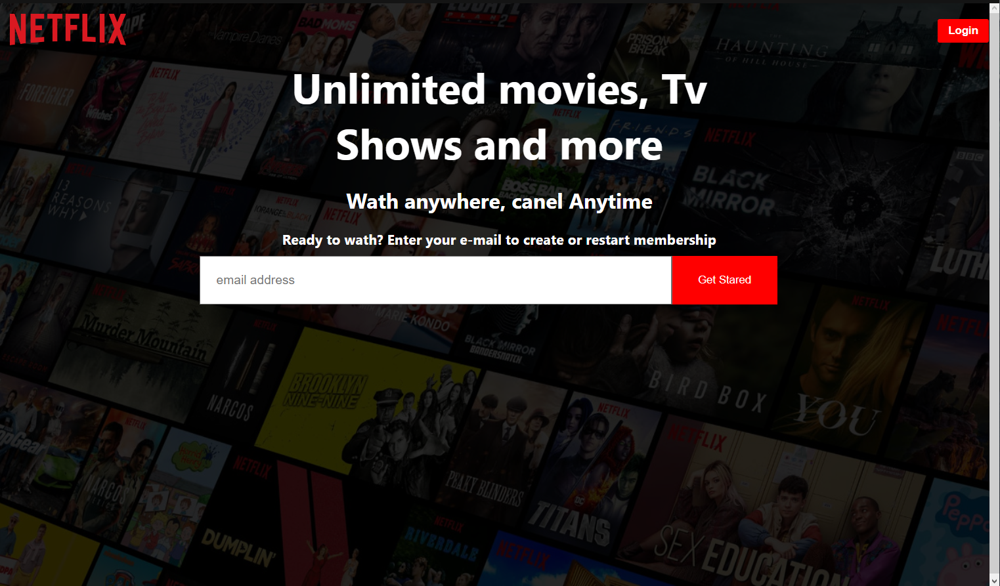

# Netflix-clone Udemy proyect

This is a project that made in a Udemy course to learn about how to use react components and put in practice everything that learn about JSX, useState hook, useRef, JSON, etc.


The packages used in this project was:
- Styled-components
- react-icons
- axios

## Pages
---

---

---

---

---

## Install APIs

Also, use a API from [The Movie Data Base](https://www.themoviedb.org) to get the recent releases and use Firebase to get a user validation to enter in the site. 

To install correctly the page you will need the utils to get the conections from Firebase and TMDB.


```js title="firebase-config.js"
// ./src/utils/firebase-config.js
// Import the functions you need from the SDKs you need
import { initializeApp } from "firebase/app";
import {getAuth} from 'firebase/auth';

// TODO: Add SDKs for Firebase products that you want to use
// https://firebase.google.com/docs/web/setup#available-libraries

// Your web app's Firebase configuration
// For Firebase JS SDK v7.20.0 and later, measurementId is optional
const firebaseConfig = {
  apiKey: "Insert-API-Key",
  authDomain: "Insert-Domain",
  projectId: "Insert-projectId",
  storageBucket: "Insert-StorageBucket",
  messagingSenderId: "ID",
  appId: "AppID",
  measurementId: "Insert"
};

// Initialize Firebase
const app = initializeApp(firebaseConfig);

export const firebaseAuth = getAuth(app);
```

```js title="constant.js"
// ./src/utils/constant.js
export const MY_API_KEY = "MyApiKey";

export const TMDB_BASE_URL = "https://api.themoviedb.org/3";
```